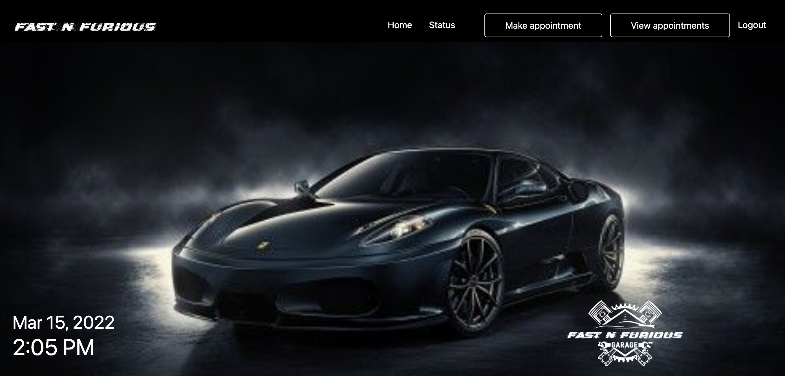
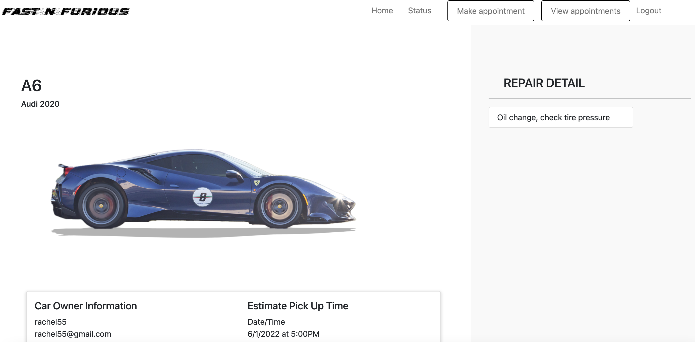
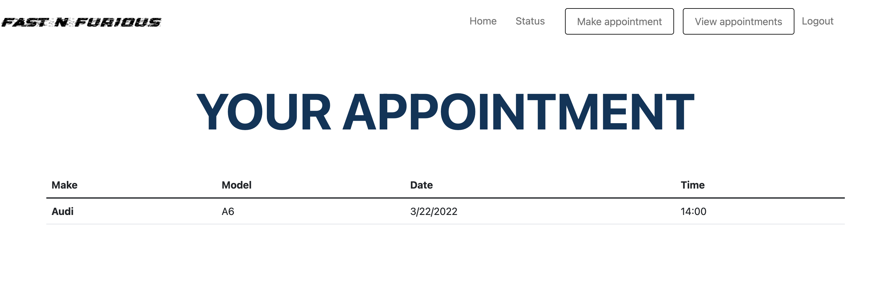
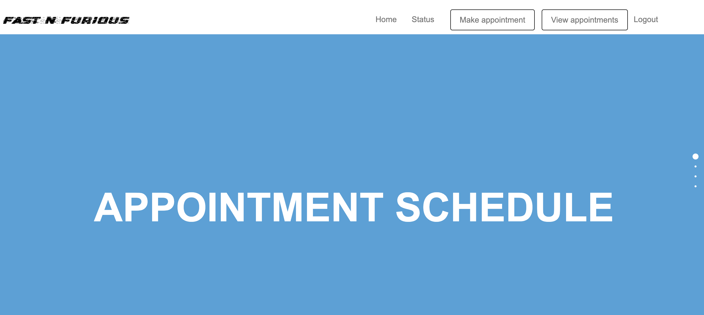

# auto_mechanics_management_sys

## Table of Contents

  - [User Story](#user-story)
  - [Description](#description)
  - [Usage](#usage)
  - [Technologies](#technologies)
  - [Link to deployed Heroku application:](#link-to-deployed-heroku-application)
  - [Installation](#installation)
  - [Photos](#installation)

## User Story
AS A Car Owner who wants to maintain the health of my car
I WANT a CMS-style application site
SO THAT I can be a aware of my car status repairs and appointments.

## Description
Fast-n-Furious allows a user to make appointments with their mechanic and check on the status of repairs when their car is in the shop. User authentication is implemented to ensure that the user either signs up or logs in before accessing the Fast-n-Furious homepage. The navigation bar on the homepages features 3 functionalities: Make Appointment, View Appointment, and Status. The Make Appointment tab will allow the user to register their vehicle, select what repairs they need, and pick a date and time for the appointment. The View Appointment tab allows the user to see their existing appointments. The Status tab allows the user to see what work is ebing done to their car.

## Usage 
Please reference this video if you would like to see a walkthrough of how the application functions.
https://drive.google.com/file/d/1F4KRttfRozSSL14Mk6PzBnO9HzjHjvQM/view 

## Technologies
We used Node.js, Express.js, Handlebars, MySQL, Sequelize,  Bootstrap, Figma, Fullpage.js

## Link to deployed Heroku application:
https://fast-n-furious.herokuapp.com/ 

## Installation

To install this application: 

$ git clone {address}
$ cd ../path/to/the/file
$ npm install
$ npm start

## Photos

